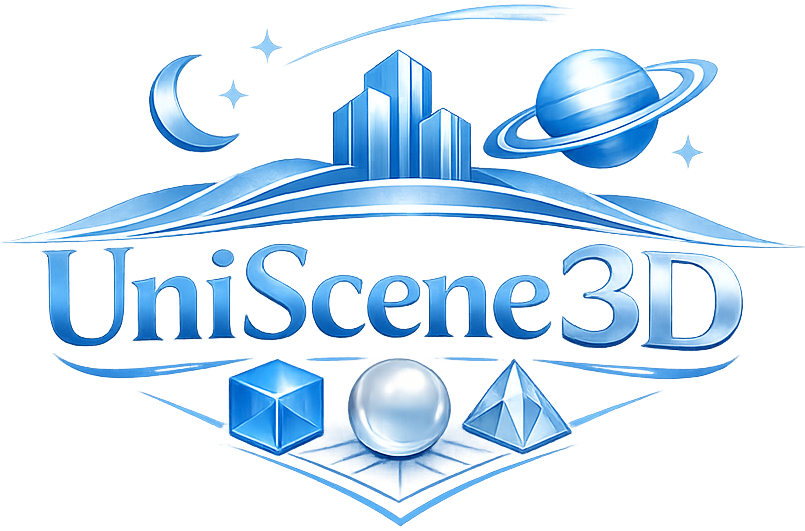
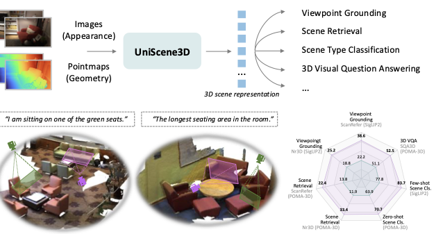

<div align="center">

<p>
  
</p>

<h1>Contrastive Language-Colored Pointmap Pretraining for Unified 3D Scene Understanding</h1>

<p>
  <a href="https://yebulabula.github.io/">Ye Mao</a>,
  <a href="https://scholar.google.com/citations?user=2Y0-0C8AAAAJ&hl=en&oi=ao">Weixun Luo</a>,
  <a href="https://ranrhuang.github.io/">Ranran Huang</a>,
  <a href="https://tomtomtommi.github.io/">Junpeng Jing</a>,
  <a href="https://profiles.imperial.ac.uk/k.mikolajczyk">Krystian Mikolajczyk</a>
</p>

<p><strong>Imperial College London</strong></p>

<p>
  <a href="https://arxiv.org/abs/2604.00000">
    
  </a>
  <a href="https://huggingface.co/MatchLab/UniScene3D">
    
  </a>
  <a href="https://huggingface.co/datasets/MatchLab/ScenePoint">
    
  </a>
</p>

<p>
  
</p>

</div>

*UniScene3D learns transferable 3D scene representations from **multi-view colored pointmaps**, unifying RGB appearance and world-aligned geometry within a single transformer encoder. We evaluate its effectiveness across diverse 3D scene understanding tasks under zero-shot, few-shot, and task-specific fine-tuning settings.*

## Contents

- [News](#news)
- [Key Takeaways](#key-takeaways)
- [Expected Repository Structure](#expected-repository-structure)
- [Installation](#installation)
- [Data Preparation](#data-preparation)
- [Pretraining](#pretraining)
- [Downstream Fine-Tuning](#downstream-fine-tuning)
- [Low-Shot Evaluation](#low-shot-evaluation)
- [Acknowledgements](#acknowledgements)
- [Citation](#citation)
- [License](#license)

## News

- 🚀 `2026-04-02`: Code, pretrained model, pretraining, and evaluation data are now available.

## Key Takeaways
- **Core Question**: Unlike 2D vision, 3D scene understanding still lacks a generalizable encoder like CLIP, largely due to the scarcity of large-scale 3D pretraining data. This raises the question: **can a 2D vision encoder be extended into a general 3D scene encoder without extensive 3D pretraining?**

- **Preliminary Finding**: Pointmaps encode world-frame geometry like point clouds while preserving an image-like format compatible with 2D vision models. Our initial study shows that pretrained 2D vision weights are also beneficial for learning pointmap features.

- **Model Contribution**: **UniScene3D** extends pretrained CLIP models to learn unified 3D scene representations from pixel-aligned, multi-view colored pointmaps by jointly encoding geometry and appearance.

- **Key Training Idea**: We introduce cross-view geometric alignment and grounded view alignment to enforce geometric and semantic consistency across viewpoints.

- **Result**: The learned representations effectively combine complementary information from images and pointmaps, generalize across diverse scenes, and transfer well to a broad range of downstream 3D tasks.

## Expected Repository Structure

```text
UniScene3D/
├── configs/
│   ├── all_pretrain.yaml
│   └── finetune/
├── dataset/                 # Language data for pretraining and evaluation.
├── scripts/                 # runnable shell entry points
├── src/
│   ├── data/
│   ├── evaluator/
│   ├── fg-clip/             # local FG-CLIP code/assets
│   ├── model/
│   ├── modules/
│   ├── optim/
│   └── trainer/
├── launch.py                # launcher for python / accelerate / submitit
├── run.py                   # main training/evaluation entry point
└── requirements.txt
```

## Installation

### 1. Create an environment

```bash
conda create -n uniscene3d python=3.10 -y
conda activate uniscene3d
```

### 2. Install PyTorch

Install a PyTorch build that matches your CUDA setup. The pinned versions used in this repo are:

- `torch==2.5.1`
- `torchvision==0.20.1`

For example, if you use pip wheels from PyTorch:

```bash
pip install torch==2.5.1 torchvision==0.20.1
```

### 3. Install the remaining dependencies

```bash
pip install -r requirements.txt
```

## Data Preparation

Please download the `dataset/` folder from Hugging Face at [MatchLab/ScenePoint](https://huggingface.co/datasets/MatchLab/ScenePoint) and place it at the repository root. This folder includes the language data required for pretraining and evaluation, including:

- `dataset/refer`
- `dataset/retrieval`
- `dataset/classification`
- dataset metadata used by the training and evaluation scripts

The scene data are hosted on the same Hugging Face dataset. When you run the training/evaluation scripts, the required scene assets will be downloaded automatically and cached locally.

The processed scene data are derived from the original [ScanNet](https://www.scan-net.org/), [3RScan](https://github.com/WaldJohannaU/3RScan), and [ARKitScenes](https://machinelearning.apple.com/research/arkitscenes) datasets. Please also refer to their official websites for the original data access terms and licenses.

## Pretraining

The default pretraining recipe is defined in [configs/all_pretrain.yaml](configs/all_pretrain.yaml).

Run:

```bash
bash scripts/pretraining/pretrain.sh
```

This script launches:

```bash
python launch.py --mode accelerate --gpu_per_node 4 --num_nodes 1 --config configs/all_pretrain.yaml
```

You can also launch manually with Hydra overrides:

```bash
python launch.py --mode accelerate --gpu_per_node 4 --num_nodes 1 \
  --config configs/all_pretrain.yaml \
  name=UniScene3D \
  note=my_run \
  num_gpu=1 \
  dataloader.batchsize=64
```

By default, experiment outputs are written under `results/`, and the runtime config is saved into each experiment directory by [run.py](run.py).

## Low-Shot Evaluation

The benchmark code lives in [src/evaluator/](src/evaluator), with shell entry points under [scripts/](scripts).

### Viewpoint Grounding

```bash
bash scripts/view_retrieval/view_ret.sh
```

### Scene Retrieval

```bash
bash scripts/scene_retrieval/scene_ret.sh
```

### Scene Type Classification

Zero-shot:

```bash
bash scripts/scene_classification/zero_shot_scene_cls.sh
```

Few-shot:

```bash
bash scripts/scene_classification/few_shot_scene_cls.sh
```

The shared evaluation environment is configured in [scripts/spatial_bench_common.sh](scripts/spatial_bench_common.sh). Important environment variables include:

- `UNISCENE3D_CKPT`: path to the UniScene3D checkpoint
- `HF_REPO_ID`: Hugging Face dataset repo id for scene assets, default `MatchLab/ScenePoint`
- `PM_KEY`: default pointmap key, `point_map`
- `RGB_KEY`: default RGB key, `color_images`

## 3DVQA Fine-Tuning

Run the provided launchers:

```bash
bash scripts/vqa3d/scanqa.sh
bash scripts/vqa3d/sqa3d.sh
bash scripts/vqa3d/hypo3d.sh
```

## Acknowledgements

We sincerely thank the authors and maintainers of [SceneVerse](https://github.com/scene-verse/SceneVerse), [3D-VisTA](https://github.com/3d-vista/3D-VisTA), and [FG-CLIP](https://github.com/360CVGroup/FG-CLIP) for releasing their code, models, and research resources. UniScene3D builds on ideas and infrastructure from these prior projects, and their open-source contributions have been invaluable to this work.

## Citation

If you find this repository useful, please cite the paper:

```bibtex
@inproceedings{mao2026uniscene3d,
  title     = {Contrastive Language-Colored Pointmap Pretraining for Unified 3D Scene Understanding},
  author    = {Mao, Ye and Luo, Weixun and Huang, Ranran and Jing, Junpeng and Mikolajczyk, Krystian},
  booktitle = {arxiv},
  year      = {2026}
}
```

## License

This project is released under the license in [LICENSE](LICENSE).
